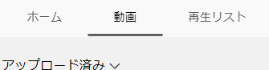

# ShowYoutubeVideosList
Youtubeチャンネルの過去動画一覧を、下のように簡素に一覧・ソートできるようにするブックマークレットです。  

YouTubeチャンネルで、（自分以外のチャンネルで）下のようなことをしたいとき、時短になるはずです。

- 動画タイトルでソート
- 長いタイトルでも省略せず一覧表示
- Ctrl+Fで全件を一回で検索

動画サムネがずらっと並んでると可視性が乏しいなと感じる方向けです。

## 導入方法
[このページ](https://haganech.github.io/ShowYoutubeVideosList/) のブックマークレットボタンを、お使いのブラウザのブックマークにドラッグアンドドロップすれば完了です。

## 使い方
(*) このスクリプトはXPathでDOM要素から一覧を生成します。そのため、まず全件が表示されている必要があります。

- ホームでなく）動画一覧ページを表示する。  
    
- Page Down (PgDn) キーを数秒押し続け、ページ末尾まで表示させる。
- Home キーでページトップまで移動する。
- ブックマークに登録したブックマークレットをクリックする。

## 注意
- 英語と日本語以外の言語ページでは正しく動作しません。
- 投稿日・再生回数は、一覧ページ上では概数のため、正確な値ではありません。
- （ホームではなく）動画一覧ページ、日付順表示でないと、正しく動作しません。
- 無保証です。

## カスタマイズ方法
このリポジトリ内の show_videos_list.js のコードをカスタマイズしたのち、[Closure Compiler Service](https://closure-compiler.appspot.com/) 等を使い、minified な表現にする必要があります。  
"<", ">", "&", ダブルクォーテーション の4つを、HTML内に記載するためのHTMLエスケープにかければ、ブラウザで直接起動可能なワンライナースクリプトになります。  
下のコードで簡易的に変換できます。  

  See the Pen <a href="https://codepen.io/hg0/pen/YzEgmGy">
  Untitled</a> by Hagane (<a href="https://codepen.io/hg0">@hg0</a>)
  on <a href="https://codepen.io">CodePen</a>.

## 参考にさせて頂いた情報
- [Bookmarkletを作ろう(準備編） - Qiita](https://qiita.com/kanaxx/items/63debe502aacd73c3cb8)
- [Introduction to using XPath in JavaScript - XPath | MDN](https://developer.mozilla.org/en-US/docs/Web/XPath/Introduction_to_using_XPath_in_JavaScript)