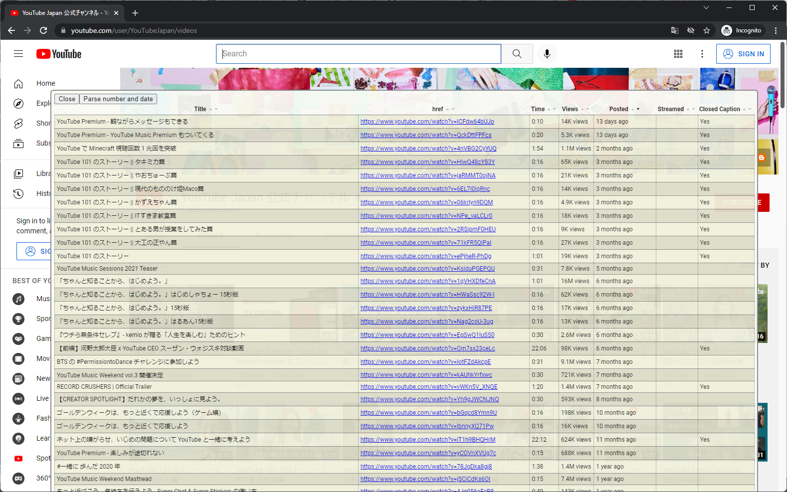

# Social Media Tabularizer
This is a bookmarklet that allows you to easily list and sort the media list of channels on video sites such as Youtube as shown below.  

It will be more efficient when you want to do something like below on a YouTube channel other than your own.

- Filter and sort by video title, number of views, number of likes, number of comments, etc.
- List long titles without abbreviating them
- Search all of the videos with keywords

Many social media sites restrict ordering/listing because of its self-righteous recommendation engines and often don't even allow in-channel search, so I created a listing tool to increase visibility and searchability.

## Installation
Drag and drop the bookmarklet button in [This page](https://haganech.github.io/socialmedia-tabularizer) into your browser's bookmark-bar.

## Procedure
- Display the page of the channel for which you want to display the video list in the browser.
- Click the bookmarklet button which has been registered in the bookmark-bar.
- Wait for a while until the list is completed.
In detial, please also check [my youtube page](https://www.youtube.com/@haganc) that I'll upload the instruction video later.

## Caution
- Not tested on language pages other than English and Japanese.
- Posting date and number of views are approximate numbers on the list page, so they are not exact values.

## To customize
After customizing the show_videos_list_api.js code in this repository, you need to use [Closure Compiler Service](https://closure-compiler.appspot.com/) etc. to make it a minified ECMAscript expression.  
See convert_to_bookmarklet.js in this repository which can be run in NodeJS to do all conversion.

## Thanks for the knowledge in these websites
- [Bookmarkletを作ろう(準備編） - Qiita](https://qiita.com/kanaxx/items/63debe502aacd73c3cb8)
- [Introduction to using XPath in JavaScript - XPath | MDN](https://developer.mozilla.org/en-US/docs/Web/XPath/Introduction_to_using_XPath_in_JavaScript)